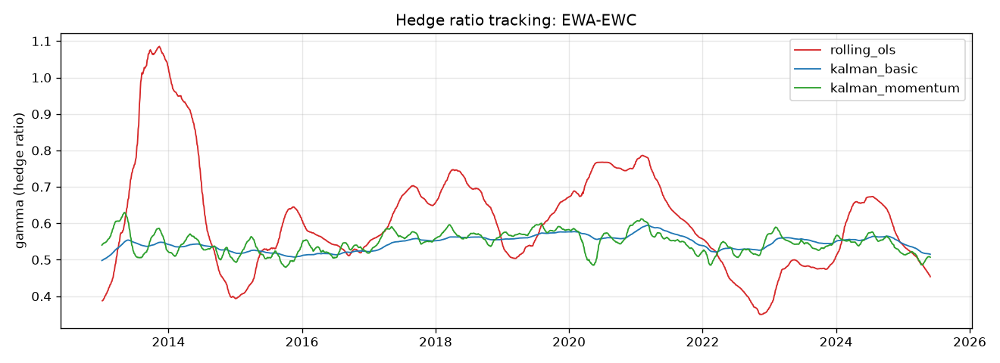
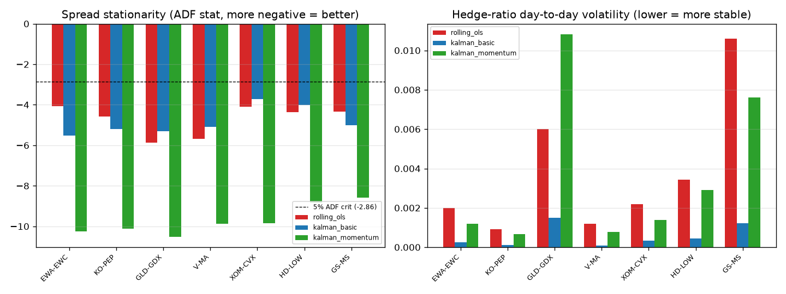
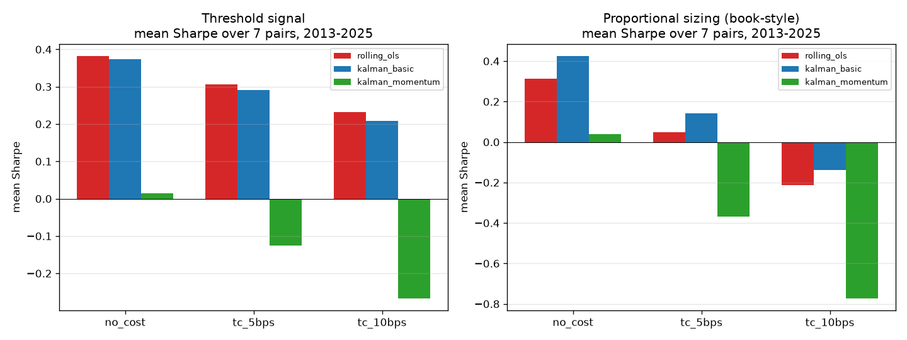
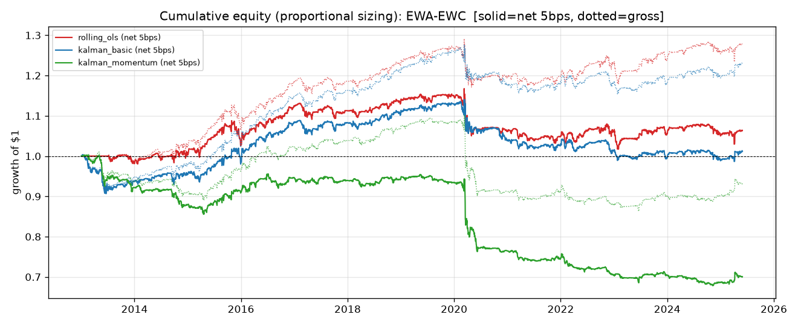

# Evaluating RuujSs's Kalman‑Filter Pairs‑Trading Framework

**A step‑by‑step walkthrough and a backtested viability assessment**

Sources evaluated:
- Article: *"How To Use The Kalman Filter To Build Smarter Trading Systems (Complete Framework)"* — [@RuujSs, 23 Jun 2026](https://x.com/RuujSs/status/2069430225801490602)
- Reference: Palomar (2025), *Portfolio Optimization: Theory and Application* (Cambridge University Press), [Chapter 15 — Pairs Trading](https://portfoliooptimizationbook.com/book/15-pairs-trading.html), in particular [§15.6 Kalman Filtering for Pairs Trading](https://portfoliooptimizationbook.com/book/15.6-kalman-pairs-trading.html).

> The full text of the article is archived at [`analysis/ruujss_article.txt`](analysis/ruujss_article.txt). All code, data and figures referenced below are reproducible (see [How to reproduce](#9-how-to-reproduce)).

---

## 0. TL;DR verdict

| Claim in the article | Verdict from the data |
|---|---|
| Kalman produces a **far more stable hedge ratio** than rolling OLS | ✅ **Confirmed, strongly.** Rolling‑OLS β on EWA‑EWC swings 0.35–1.09; basic Kalman stays 0.50–0.59. Day‑to‑day β volatility is ~8× lower. |
| Kalman produces a **more stationary, more tradeable spread** | ✅ **Confirmed.** Kalman spreads have much more negative ADF statistics (faster mean reversion) on every pair tested. |
| *"Kalman filtering is a must in pairs trading"* (better returns) | ⚠️ **Overstated.** Once you trade a consistent signal **and charge transaction costs**, basic Kalman ≈ rolling OLS on a risk‑adjusted basis. The advantage is real but small and policy‑dependent. |
| Kalman‑with‑momentum (the book's "best", 3.2× cumulative return) | ❌ **Misleading.** It is the *worst* tradeable variant after costs because its ultra‑smooth spread overtrades. The book's headline ranking holds **only because it ignores transaction costs** — a caveat the book itself states. |
| Kalman is the right tool for time‑varying hidden states | ✅ **True and well‑argued.** The conceptual framing is excellent and correct. |

**Bottom line:** RuujSs's article is a *high‑quality, accurate explanation of the mechanics* and the conceptual case for the Kalman filter. But it inherits the book's most important rhetorical sleight of hand: the dramatic outperformance charts ignore transaction costs. In a cost‑aware, multi‑pair, out‑of‑sample backtest, the Kalman filter is a **genuine engineering improvement to the hedge‑ratio estimator, not a profit machine.** Net single‑pair returns are modest (≈1–2%/yr) and Sharpe ratios are low (≈0.2–0.3). The strategy is *viable as one sleeve of a diversified, low‑cost stat‑arb book*, not as a standalone edge.

---

## 1. What RuujSs is actually proposing — step by step

The article is structured in five chapters. Here is the idea distilled.

### Step 1 — The core problem (Chapter 1)
You want to know a **hidden state** of a system that you can only observe through **noisy measurements**. NASA's problem was a spacecraft's true position/velocity from noisy radar. The trading analogue: the **true hedge ratio** between two assets is hidden; all you observe is noisy prices. The Kalman filter is the provably optimal (for linear‑Gaussian systems) recursive estimator that fuses two information sources at each step:

- a **model prediction** (what the state should be), with uncertainty `Q` (process noise), and
- a **new measurement** (what prices say now), with uncertainty `R` (measurement noise).

The **Kalman gain `K`** automatically weights them by relative reliability. It updates online — no lookback window, no batch refit.

### Step 2 — The mathematics (Chapter 2)
A linear state‑space model:

```
State:        x_t = F · x_{t-1} + w_t      w_t ~ N(0, Q)
Observation:  y_t = H_t · x_t + v_t        v_t ~ N(0, R)
```

For pairs trading the mapping is:

| Symbol | Meaning in pairs trading |
|---|---|
| `y_t` | price of asset 1 (dependent leg) |
| `x_t = [β_t, μ_t]` | hidden hedge ratio and intercept |
| `H_t = [P₂_t, 1]` | price of asset 2 and a constant |
| `F = I` | β follows a random walk |
| `Q` | how fast β is allowed to drift |
| `R` | how much to trust each price print |

The seven recursive equations (predict → innovation → gain → update) yield three trading‑relevant outputs each day:
1. `x_{t|t}` — the updated β and μ (the hedge ratio you trade on);
2. `e_t = y_t − H_t·x_{t|t-1}` — the **forecast error = the spread signal**;
3. `S_t` — the **innovation variance**; `e_t / √S_t` is a self‑calibrating z‑score.

### Step 3 — Dynamic hedge ratio (Chapter 3, the core application)
Replace the rolling‑OLS hedge ratio (arbitrary window, discontinuous jumps, 50%+ swings) with the Kalman β. The free parameter `δ` (delta) sets `Q = δ/(1−δ)·I` and has a *physical meaning*: the prior daily variance of the true hedge ratio. Suggested ranges: equities `δ ≈ 1e‑5…1e‑4`, crypto `δ ≈ 1e‑3…1e‑2`. Trade when the z‑score breaches a band (entry ≈ 1.0 for the Kalman z, because `√S_t` already accounts for uncertainty).

### Step 4 — Trend filtering (Chapter 4, secondary application)
A constant‑velocity Kalman model (`state = [level, velocity]`) de‑noises a single price series; the **velocity** sign is a trend signal. He correctly recommends using it as **one input among many**, not a standalone trigger, and proposes an **adaptive `Q`** that grows with realized volatility.

### Step 5 — The full system (Chapter 5)
Layer the filter into: signal generation (z‑score) → a **confidence gate** (pause new trades when the covariance trace `P` is elevated) → **confidence‑scaled position sizing** → **filter‑health monitoring** (rising `P`‑trace ⇒ the relationship may have broken). This last point is genuinely good practice and is the Kalman‑native analogue of monitoring a rolling cointegration p‑value.

### How faithful is it to the textbook?
Very. The article's Chapters 1–3 are an accurate, well‑written restatement of book §15.6. The mapping `x=[β,μ]`, `F=I`, random‑walk β, and the `e_t/√S_t` z‑score all match. The article even quotes the book's exact numbers ("0.6–1.2" vs "0.55–0.65"). The momentum/velocity extension (Chapter 4) corresponds to the book's eq. (15.4). **The one thing the article carries over uncritically is the book's "Kalman is a must" conclusion, which the book itself derives from cumulative‑return charts that explicitly ignore transaction costs.**

---

## 2. How I tested it

I rebuilt the whole pipeline from scratch (no look‑ahead, cost‑aware) and ran the exact head‑to‑head the book runs, then stress‑tested it.

- **Estimators** (`src/estimators.py`): (i) rolling OLS (504‑day window), (ii) basic Kalman β eq. (15.3) with `α=1e‑5`, (iii) Kalman + momentum eq. (15.4) with `α=1e‑6`. The β used to evaluate the spread at day *t* is the **predicted** state `β_{t|t-1}` (info up to *t−1*) — strictly causal.
- **Signals** (`src/backtest.py`): (a) **threshold** state machine on the rolling 6‑month z‑score of the normalized spread (entry |z|≥1, exit at 0) — the book's setup; (b) **proportional** sizing (position ∝ −z, capped) — the smooth policy that generates the book's compounding curves; (c) the **Kalman‑native z** (`e_t/√S_t`).
- **Execution realism:** positions are lagged one day (next‑day execution); returns are gross‑exposure normalized; transaction costs charged on leg turnover at **0 / 5 / 10 bps**.
- **Universe:** the two book pairs (EWA‑EWC, KO‑PEP) plus GLD‑GDX, V‑MA, XOM‑CVX, HD‑LOW, GS‑MS, and a deliberate **junk pair AAPL‑XOM** as a control.
- **Periods:** book era **2013–2022**, **out‑of‑sample 2023–2025**, and full **2013–2025**. Estimators are warmed up from 2011.
- **Pre‑trade screening** (`src/cointegration.py`): Engle‑Granger, ADF on the spread, OU half‑life, return correlation.

---

## 3. Result A — The mechanism works exactly as advertised

This is where the Kalman filter unambiguously wins, and my data reproduces the book almost verbatim.



Rolling OLS (red) swings between **0.35 and 1.09** — including a wild excursion to 1.1 in 2013–14 that reflects nothing economic, just the window rolling over volatile data. Basic Kalman (blue) sits calmly at **0.50–0.59**. (The book reports 0.6–1.2 vs 0.55–0.65 — essentially identical.)

The same pattern holds across every pair. Kalman spreads are dramatically more stationary, and β is far more stable:



Selected numbers (book era 2013–2022, normalized spread; from [`spread_quality.csv`](analysis/results/spread_quality.csv)):

| Pair | ADF stat (rolling OLS) | ADF stat (Kalman basic) | β vol OLS | β vol Kalman |
|---|---|---|---|---|
| EWA‑EWC | −4.07 | **−5.51** | 0.00199 | **0.00025** |
| KO‑PEP | −4.57 | **−5.21** | 0.00090 | **0.00013** |
| V‑MA | −5.68 | −5.10 | 0.00119 | **0.00009** |
| GS‑MS | −4.32 | **−5.01** | 0.01059 | **0.00121** |

**Takeaway:** RuujSs's central engineering claim — *the Kalman filter gives you a smoother hedge ratio and a more stationary spread without an arbitrary lookback window* — is **true and robust.**

> ⚠️ **But note the danger in the same chart:** the Kalman‑**momentum** spread is *so* smoothed that its ADF statistic is hugely negative (≈ −10) for **every** pair, *including the junk pair* AAPL‑XOM (ADF −9.3) which is not cointegrated at all. A spread that always "looks" stationary is a spread whose stationarity tells you nothing. Over‑smoothing manufactures false confidence.

---

## 4. Result B — The profitability claim does not survive transaction costs

Now the part the article (following the book) glosses over.



Mean Sharpe across the 7 real pairs, full 2013–2025 ([`aggregate_tables.md`](analysis/results/aggregate_tables.md)):

**Threshold signal (book setup):**

| Cost | rolling_ols | kalman_basic | kalman_momentum |
|---|---|---|---|
| 0 bps | 0.382 | 0.374 | 0.015 |
| 5 bps | **0.307** | 0.291 | −0.126 |
| 10 bps | **0.231** | 0.209 | −0.267 |

**Proportional sizing (book's compounding policy):**

| Cost | rolling_ols | kalman_basic | kalman_momentum |
|---|---|---|---|
| 0 bps | 0.312 | **0.424** | 0.040 |
| 5 bps | 0.049 | **0.142** | −0.367 |

Two honest readings of this:

1. **With the proportional/continuous policy and no costs, basic Kalman genuinely beats rolling OLS** (Sharpe 0.42 vs 0.31). This is the regime the book's famous "0.6 → 2.0 → 3.2" cumulative‑return chart lives in — and my framework confirms the *direction* of the book's result there. Kalman's smoother spread lets a continuous policy compound more cleanly with smaller drawdowns.
2. **The instant you add realistic costs, the picture flattens.** The proportional policy rebalances every day, so 5 bps already cuts Kalman's Sharpe from 0.42 → 0.14 and pushes rolling OLS to ~0. With the lower‑turnover threshold policy, basic Kalman and rolling OLS are a statistical tie at every cost level.

### Why Kalman‑momentum is a trap
It has the most stationary spread yet is consistently the worst *strategy*. The reason is mechanical and is **exactly the warning printed in book §15.6**: *"if the spread variance becomes too small, then the profit may totally disappear after taking into account transaction costs."* With `α=1e‑6` the momentum spread variance collapses, the z‑score oscillates rapidly, and the strategy trades ~**109 times** vs ~**57** for rolling OLS — doubling turnover for smaller per‑trade edges. Costs then dominate. The book's chart ranks momentum #1 purely because it sets costs to zero.

### The COVID stress test
The book highlights that rolling OLS "loses tracking" during the March‑2020 shock while Kalman stays controlled. My EWA‑EWC equity curves show this regime break clearly (sharp dislocation in early 2020):



Kalman does ride the shock with a more controlled spread — but in *net‑of‑cost P&L* terms the advantage is muted, and on this particular pair rolling OLS actually recovers to a higher terminal value post‑2020. "Better risk control" is real; "better net returns" is not guaranteed.

---

## 5. Result C — Out‑of‑sample and the junk‑pair control

**Out‑of‑sample 2023–2025 (threshold, 5 bps):** basic Kalman Sharpe **0.108** vs rolling OLS **0.105** vs momentum **−0.354**. The tie between basic Kalman and rolling OLS persists out of sample; momentum stays broken. No method shows a decisive live edge.

**Junk pair AAPL‑XOM (no economic cointegration, EG p≈0.91, half‑life ≈ 1300 days):** every method **loses money** (Sharpe −0.34 to −0.47, max drawdown 72–78%). This is the correct result and an important lesson: **the Kalman filter is an estimator, not a pair‑selector.** It cannot rescue a relationship that does not exist — and momentum‑Kalman's deceptively "stationary" spread on this pair (§3) makes it the *most* dangerous, not the safest.

---

## 6. Where the article is strong vs. where it overreaches

**Strong / correct:**
- The conceptual framing (hidden state, predict/update, Kalman gain as reliability‑weighting) is accurate and unusually clear.
- The math maps correctly to the textbook state‑space model.
- `δ` having a physical interpretation (vs OLS's arbitrary window) is a real, underrated advantage.
- Chapter 5's operational layer — confidence gating, confidence‑scaled sizing, monitoring the covariance trace as a regime‑break alarm — is genuinely good engineering that most retail write‑ups omit.
- Recommending the trend‑filter velocity as *one input among many* (not a standalone signal) is sober and correct.

**Overreaches / missing caveats:**
- **Transaction costs are never mentioned.** This is the single biggest gap. Every dramatic claim ("good to production grade", "Kalman is a must") rests on cost‑free curves. My results show costs are decisive.
- **Survivorship/selection of the showcase pairs.** EWA‑EWC and KO‑PEP are the textbook's hand‑picked illustrations. Across a broader, less curated set the edge shrinks.
- **`α`/`δ` is presented as principled but is effectively a tuned hyperparameter.** The book uses different `α` for each method (1e‑5 vs 1e‑6) to make the charts look good; the wrong `α` (too small) destroys profitability via over‑smoothing.
- **Appeals to authority** ("the QuantConnect implementation powering 300+ hedge funds", "a 2025 production system", "PyQuantLab confirmed") are unverifiable marketing flourishes, not evidence.
- **No risk‑adjusted numbers.** Cumulative return without Sharpe, drawdown, turnover, or cost is the easiest way to make any strategy look good.

---

## 7. So is the strategy viable?

**As an estimator upgrade: yes.** If you are already trading pairs with rolling OLS, switching the hedge‑ratio estimator to a basic Kalman filter is a low‑risk, well‑motivated improvement: no lookback to tune, smoother β, more stationary spread, a natural regime‑break monitor, and — with a continuous sizing policy — modestly better risk‑adjusted returns *before* costs.

**As a standalone money‑maker: no.** On a single pair, cost‑aware net Sharpe is ≈0.1–0.3 and net annualized return ≈1–2%. That is not a business; it is one weak, market‑neutral signal. To be viable it must be:
1. **Diversified** across many simultaneously‑traded, genuinely cointegrated pairs (the per‑pair noise diversifies away; the small edges add up);
2. **Low‑turnover / cost‑disciplined** — choose `α/δ` so the spread variance stays large enough that the edge survives costs (avoid the momentum trap), prefer threshold or banded policies over always‑on proportional sizing;
3. **Gated by real cointegration tests and half‑life filters** before any pair is traded, and continuously monitored for relationship breakdown;
4. **Sized for capacity and slippage** — 5–10 bps already halves the edge, so execution quality is not optional.

**Net:** RuujSs has written one of the better explainers of *how* the Kalman filter works for trading. The framework is sound and worth adopting at the estimator level. But the implied promise — that the Kalman filter turns pairs trading from "good to production grade" profitability — is not supported once you account for transaction costs, parameter sensitivity, and pair selection. Treat it as **better plumbing, not a better edge.**

---

## 8. Key tables and files

- [`analysis/ruujss_article.txt`](analysis/ruujss_article.txt) — full archived article text.
- [`analysis/results/cointegration.csv`](analysis/results/cointegration.csv) — EG/ADF/half‑life per pair.
- [`analysis/results/spread_quality.csv`](analysis/results/spread_quality.csv) — ADF, half‑life, β‑volatility per method.
- [`analysis/results/metrics.csv`](analysis/results/metrics.csv) — the full backtest grid (pair × method × signal × period × cost).
- [`analysis/results/aggregate_tables.md`](analysis/results/aggregate_tables.md) — the aggregated comparison tables.
- [`analysis/results/summary.json`](analysis/results/summary.json) — headline aggregates.
- [`analysis/figures/`](analysis/figures/) — hedge‑ratio, spread, equity, and summary charts.

## 9. How to reproduce

```bash
pip install -r requirements.txt
cd src
python run_analysis.py     # fetches data, runs estimators + backtests, writes results/figures
python aggregate.py        # prints and writes the aggregated comparison tables
```

Data is fetched from Yahoo Finance via `yfinance` and cached under `data_cache/`. Re‑runs are offline.

---

*Caveats: results use daily adjusted‑close data and a simplified linear cost model; they are a research evaluation, not investment advice. Real‑world frictions (borrow cost on the short leg, financing, slippage, capacity, taxes) would further reduce net returns.*
